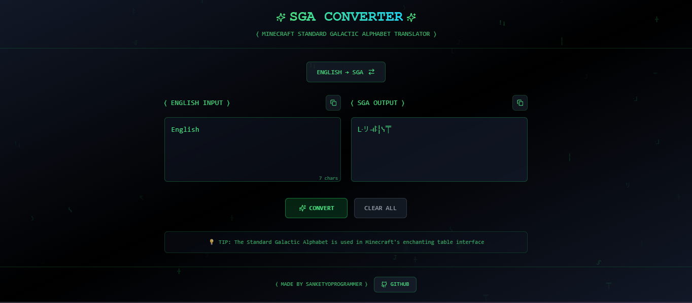

# Galactic Craft Cipher

A futuristic Minecraft-themed SGA (Standard Galactic Alphabet) converter and encryption tool. Transform your text into the mysterious Standard Galactic Alphabet used in Minecraft's enchanting table language, with a modern and intuitive interface.

## 📸 Screenshot



## 🚀 Features

- Convert text to and from Standard Galactic Alphabet (SGA)
- Minecraft-themed UI with enchanting table aesthetics
- Real-time text conversion
- Copy to clipboard functionality
- Dark/Light theme support
- Responsive design for all devices
- Beautiful animations and transitions

## 🛠️ Tech Stack

- **Frontend Framework:** React 18
- **Language:** TypeScript
- **Build Tool:** Vite
- **Styling:** Tailwind CSS
- **UI Components:** shadcn/ui (Radix UI)
- **Form Handling:** React Hook Form + Zod
- **Data Fetching:** TanStack Query
- **Routing:** React Router DOM
- **Charts:** Recharts
- **Date Handling:** date-fns
- **Animations:** tailwindcss-animate

## 📦 Installation

1. Clone the repository:
```bash
git clone https://github.com/Sanket3yoProgrammer/galactic-craft-cipher.git
cd galactic-craft-cipher
```

2. Install dependencies:
```bash
npm install
```

3. Start the development server:
```bash
npm run dev
```

## 🏗️ Available Scripts

- `npm run dev` - Start development server
- `npm run build` - Build for production
- `npm run build:dev` - Build for development
- `npm run preview` - Preview production build
- `npm run lint` - Run ESLint

## 🎮 How to Use

1. Enter your text in the input field
2. Choose conversion direction (Text to SGA or SGA to Text)
3. Your converted text will appear instantly
4. Use the copy button to copy the result to your clipboard
5. Toggle between light and dark themes using the theme switcher

## 🎨 UI Components

The project uses shadcn/ui, which provides a collection of reusable components built with Radix UI and Tailwind CSS. Available components include:

- Accordion
- Alert Dialog
- Avatar
- Checkbox
- Dialog
- Dropdown Menu
- Navigation Menu
- Popover
- Progress
- Radio Group
- Select
- Slider
- Switch
- Tabs
- Toast
- Tooltip
- And many more...

## 📝 License

This project is licensed under the MIT License - see the LICENSE file for details.

## 👨‍💻 Author

Created by [Sanket Kumar Padhan](https://github.com/Sanket3yoProgrammer) 